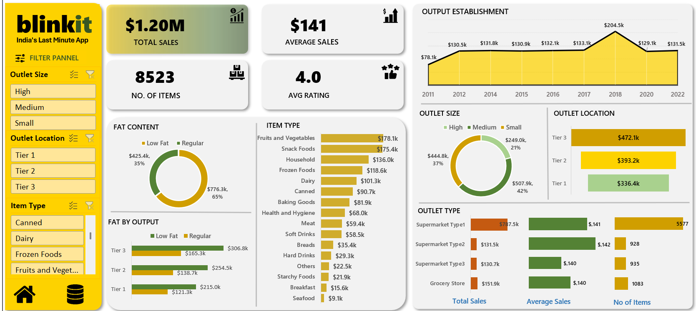

# BLINKIT SALES DASHBOARD

## 🎯 Objective
To conduct a comprehensive analysis of Blinkit's sales performance, customer satisfaction, and inventory distribution to identify key insights and opportunities for optimization using various KPIs and visualizations in Excel.

## 📄 Overview
This project transforms 8,500 order‐level records into a dynamic Excel dashboard that:
- Highlights **Key Performance Indicators** (Total Sales, Avg. Sales per Order, Total Items Sold, Avg. Rating) at a glance.
- Supports real‐time filtering via **Slicers** (Outlet Size, Outlet Location, Item Type).
- Empowers quick “slice‐and‐dice” analysis through PivotTables, charts, and KPI cards.

## 📸 Dashboard Preview

🧾 [View Spreadsheet](Spreadsheet/)

## 📊 Key Performance Indicator (KPIs)

| **KPI**                    | **Value** |
|----------------------------|-----------|
| **Total Sales**            | $1.20M   |
| **Average Sales/Order**    | $141      |
| **Total Items Sold**       | 8,523     |
| **Average Customer Rating**| 4.0★     |

## 🔍 Visualization 
1. **Sales by Fat Content (Donut Chart)**  
2. **Sales by Item Type (Clustered Bar)**  
3. **Outlet Performance by Fat Content (Stacked Bar Chart)**  
4. **Sales Trend by Outlet Establishment Year (Line Chart)**  
5. **Sales by Outlet Size (Clustered Column Chart)**  
6. **Sales by Outlet Location Tier (Clustered Column Chart)**  
7. **Outlet Type Summary (PivotTable)**

## 💡 Results & Insights

### **Low-Fat vs. Regular Sales**
- **Numbers:** Low-Fat = $776.3 K (65%), Regular = $425.4 K (35%).
- **Insight:** Health-oriented SKUs dominate across all tiers, so expanding low-fat selections can further boost revenue.

### **Top Item Categories**
- **Numbers:** Fruits & Vegetables = $178.1 K; Snack Foods = $175.4 K; Household + Frozen + Dairy combined = $356 K.
- **Insight:** Fruits & Veg and Snacks together drive ~30 % of category revenue, suggesting targeted promotions here yield high returns.

### **Customer Ratings**
- **Numbers:** Overall 4.0 ★; top categories (Fruits & Veg, Snacks) rate ≥4.1 ★.
- **Insight:** Strong alignment between high sales and high ratings indicates these categories appeal both in quality and demand.

### **Outlet Establishment Impact**
- **Numbers:** 2018 cohort peaked at $204.5 K(53%), pre-2017 outlets average $130–$133 K, post-2018 settle near $130 K.
- **Insight:** The 2018 spike suggests a successful campaign or expansion; replicating that strategy could help newer outlets catch up.

### **Outlet Size Distribution**
- **Numbers:** Small = $507.9 K, Medium = $444.8 K, High-Capacity = $249.0 K.
- **Insight:** A network of smaller-format stores outpaces larger ones, indicating that convenience locations are key revenue drivers.

### **Location Tier Distribution**
- **Numbers:** Tier 3 = 39%, Tier 2 + Tier 1 combined = 61%.
- **Insight:** Urban outlets outperform rural by 40% so prioritizing Tier 3 expansion can unlock significant incremental sales.

### **Outlet Type Comparison**
- **Numbers:** Supermarket Type 1 $787.5 K vs. Type 2/3 = $131 K each; Grocery Stores \$151.9 K; all maintain \$140–\$142 avg./order.
- **Insight:** While Type 1 leads in total revenue, consistent avg. order values across formats point to optimizing Type 2/3 operations as a path to lift overall sales.

